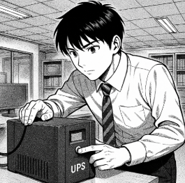

# T02: Selecció d’un SAI per una empresa client

## Breu descripció

L’empresa **TecnoGestió S.L.**, dedicada a la gestió documental i assessorament informàtic, té un petit despatx amb **4 ordinadors de sobretaula**, una **impressora-fotocopiadora multifunció** (similar a les que té l’escola) i un **router d’accés a Internet**.  

Davant les constants incidències amb el subministrament elèctric a la zona, la direcció ha decidit adquirir un **SAI** per garantir la continuïtat del servei i protegir els equips.

S’han posat en contacte amb l’empresa on esteu fent l’estada i el vostre responsable us ha encarregat que en feu **l’estudi i tria del SAI**.

---

## Tasques a realitzar

### 1. Inventari d’equips

- Llista dels dispositius que es connectaran al SAI (ordinadors, monitors, router, etc.).  
- Justifiqueu si hi ha algun aparell que **no** es connectarà al sistema d’alimentació ininterrompuda.  
- Consulteu les **especificacions tècniques** per obtenir el consum de cada dispositiu.  
- Seleccioneu components que s’ajustin als que podríeu trobar a la seu del client.  
- Indiqueu clarament les **dades del component triat** i els **valors de watts i VA** corresponents.

---

### 2. Càlcul de potència total

- Calcular el **valor total de potència**.  
- Afegir una **reserva del 20%** al resultat.

---

### 3. Determinació de l’autonomia

- Estimar el **temps mínim** que el SAI ha de mantenir els equips en funcionament  
  (per exemple, *10 minuts per guardar treballs i apagar correctament*).

---

### 4. Recerca de models de SAI

- Buscar **2 o 3 models de SAI** que compleixin els requisits establerts.  
- Comparar-ne les característiques:
  - Potència  
  - Autonomia  
  - Tipus de sortides  
  - Preu  
  - Marca  

---

### 5. Informe tècnic

Redactar un informe tècnic que inclogui:

- Càlculs realitzats  
- Models analitzats  
- Justificació de la selecció final
  
