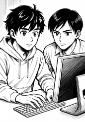

# T03: Seguretat Lògica — recuperant accés a sistemes

## Breu descripció

Després de la primera feina exitosa, us arriba un encàrrec urgent que obliga a que us hi poseu per donar-li solució.  
Com a fase prèvia rebreu una formació sobre la seguretat lògica que us permetrà tenir els coneixements necessaris per afrontar la tasca.

Han arribat a la consultora un equip provinent d’un client que demana que els hi solucionem el problema. Tenen un portàtil amb Zorin OS (un Linux amb entorn gràfic) que usava habitualment un directiu. El problema és que ha oblidat la contrasenya i és necessari poder recuperar l’accés perquè hi ha documentació molt important que cal recuperar. Per evitar que una acció catastròfica pugui danyar l’equip original, ens han clonat el disc en un disc virtual perquè hi treballeu.

Per tant, el primer pas serà crear una màquina virtual a la qual connectareu aquest disc. A continuació, cal que entreu a la màquina virtual, trobeu el nom de l’usuari existent i assigneu-li una contrasenya nova.

Quan el client és informat del senzill que és accedir a l’equip, demana si n’hi ha alguna manera de fortificar el sistema, ja que té por que si algú roba el portàtil hi pugui accedir a la informació que hi conté. Per tant, ara ens demanen que cerquem solucions per tal d’evitar que es pugui reiniciar la contrasenya amb el procediment anterior.  
Investigueu el procediment per tal que l’accés al GRUB quedi protegit per contrasenya per evitar canvis de configuració.

---

## Objectius

- Recuperar l’accés a un sistema Linux (Zorin OS) a partir d’un disc virtual clonat.  
- Identificar l’usuari existent i assignar-li una nova contrasenya.  
- Investigar i implementar mesures per fortificar l’accés al GRUB (incloent protecció amb contrasenya).  
- Documentar tot el procediment (amb imatges) i pujar-ho al vostre repositori.

---

## Procediment individual (resum de passos)

### Preparar l’entorn
- Crear una màquina virtual (VM) i connectar-hi el disc virtual proporcionat.

### Vulnerar l’accés al GRUB del Linux
- Arrencar la VM i usar el menú de GRUB per accedir a un mode que permeti obtenir un shell de recuperació (ex.: editar la línia del kernel i afegir `init=/bin/bash` o arrancar en mode single-user, segons calgui).

### Identificar l’usuari del sistema
- Un cop amb accés a la shell/entorn de recuperació, consultar `/etc/passwd` o `/home` per identificar el nom d’usuari existent.

### Modificar la contrasenya
- Remuntar el sistema en lectura-escriptura si cal (p. ex. `mount -o remount,rw /`) i usar `passwd <usuari>` per assignar una nova contrasenya.  
- Verificar que l’usuari pot iniciar sessió a l’entorn gràfic amb la nova contrasenya.

### Investigar com fortificar l’accés al GRUB
- Recercar i documentar procediments per protegir GRUB amb contrasenya i altres bones pràctiques (per exemple: xifrat del disc, UEFI Secure Boot, desactivar arrencada des de dispositius externs, usar TPM, etc.).  
- És molt important indicar les fonts d’informació que s’utilitzin.

### Configurar la màquina virtual per fortificar l’accés al GRUB
- Implementar la protecció del GRUB (creació d’una contrasenya per al menú de grub, modificar `/etc/grub.d/40_custom` o `/etc/grub.d/01_users`, executar `grub-mkpasswd-pbkdf2`, i actualitzar la configuració amb `update-grub`).  
- Aplicar altres mesures recomanades i verificables a la VM.

### Documentar el procediment
- Crear un document detallat amb totes les accions realitzades, captures de pantalla i comandes utilitzades.  
- Preparar el fitxer per pujar-lo al repositori.

---

## Entregables

Documentació en format (PDF / Markdown) que inclogui:

- Descripció dels passos seguits.  
- Comandes executades.  
- Captures de pantalla (imatges) que mostrin cada fase clau (arrencada GRUB, identificació d’usuari, canvi de contrasenya, configuració de GRUB amb contrasenya).  
- Referències / fonts utilitzades.  
- Fitxer o instruccions per a la configuració del GRUB (snippets de configuració).  
- Evidència que l’usuari recuperat pot iniciar sessió amb la nova contrasenya.  
- Evidència que la protecció del GRUB funciona (p. ex. prova d’intent d’edició del menú que requereix contrasenya).

---

## Material de suport

- Disc virtual (proporcionat pel client).  
- Apunts: RA1AA4 Seguretat Lògica.  
- Article de referència per a recuperació de contrasenya en Linux:  
  [Recuperant Password en Linux](https://waytoit.wordpress.com/2013/06/06/recuperando-password-en-ubuntu/)

---

## Notes i bones pràctiques

- Feu sempre les operacions sobre la còpia del disc (no sobre l’equip físic original).  
- Documenteu la seqüència exacta de comandes i captures per a reproducibilitat i auditories.  
- Quan implementeu proteccions al GRUB, proveu-les completament (arrencada, edició, recuperació) per assegurar que no bloquegeu l’accés legítim de forma irreversible.  
- Considereu mesures addicionals (xifrat complet del disc amb LUKS, contrasenyes de firmware/BIOS/UEFI, deshabilitar arrencada per USB, actualització de GRUB i del sistema) per augmentar la seguretat.
