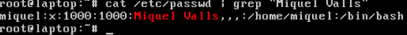

# T03: Seguretat Lògica — recuperant accés a sistemes

## Part 1: Canvi de password

Entrem a la màquina que hem creat amb el disc de Miquel Valls. Si no s’obra aquesta configuració, pressionarem en el moment d’arrancada de la màquina `**SHIFT + tecla aleatòria**`.

Seleccionem **“Advanced options for Zorin”**.

Aquí seleccionem qualsevol de les dos opcions que s’indiqui **“recovery mode”**, per poder anar a l’apartat de root on canviarem el password.

Si intentem canviar la contrasenya ara, ens sortirà un missatge d’error, per això abans de tot hem de fer:  `**mount -rw -o remount /**`

Montem el arxiu en mode lectura/escriptura abans de poder fer canvis.  
A continuació, per poder canviar la contrasenya hem de saber el seu user, per això farem un `cat` a la carpeta de contrasenyes i filtrarem només la informació que contingui “Miquel Valls”, amb la comanda:  `**cat /etc/passwd | grep “Miquel Valls”**`

Amb `passwd miquel(nom d'usuari)` podem canviar la contrasenya de l’usuari.  
A continuació d’haver posat la comanda, haurem d’escriure dos vegades la contrasenya que vulguem, i ja es faran els canvis.

---

## Part 2: Fortificació del Grub

Per primer pas al entrar, serà establir una contrasenya, per això entrarem al grub i a l’apartat de root posarem: `**sudo grub-mkpasswd-pbkdf2 (contrasenya)**`

Amb `nano /etc/grub.d/40.custom` entrem a l’arxiu per editar i poder posar una contrasenya al grub.  
Després, ens donarà la contrasenya en format hash.

Un cop obrim l’arxiu, haurem d’afegir abaix del codi:

`**set superusers="usuari_exemple"**`
`**password_pbkdf2 usuari_exemple hash.exemple**`

Quan acabem, tanquem l’arxiu guardant els canvis.

I actualitzem el grub amb: `**sudo update-grub**`

Per guardar la configuració, fem: `**sudo grub-mkconfig -o /boot/grub/grub.cfg**`

I ara quan entrem, ens demanarà que possem l’usuari i la contrasenya que hem possat.
